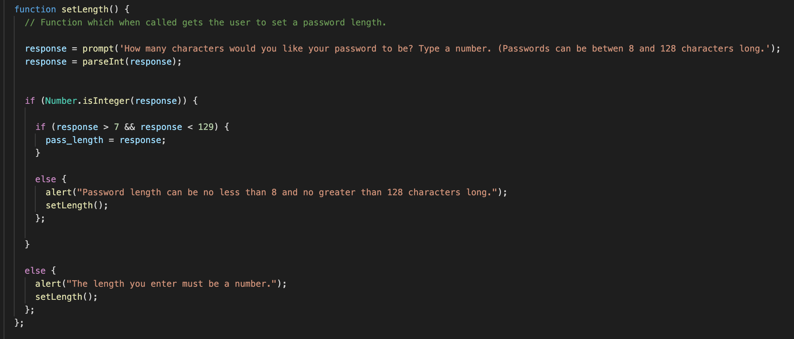
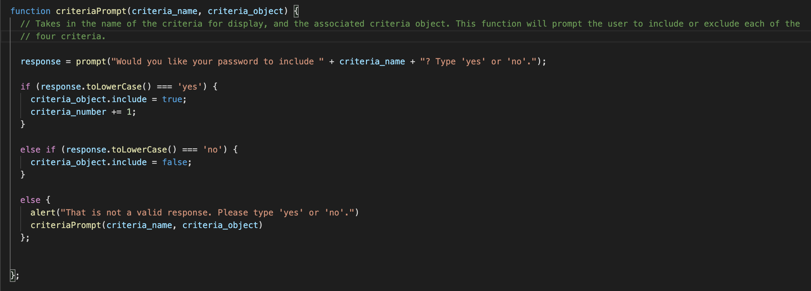
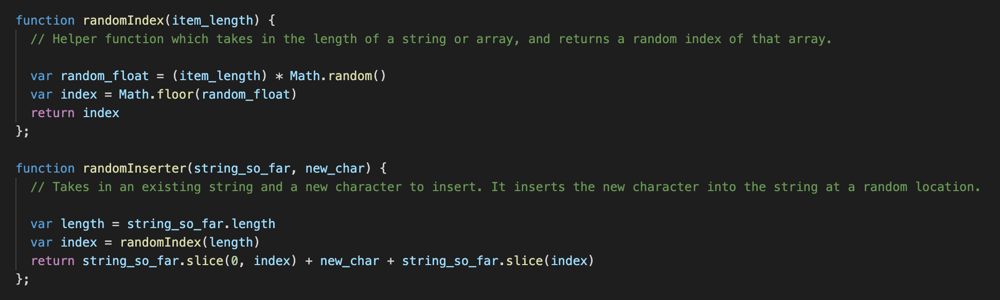
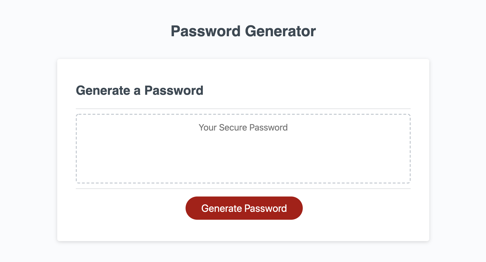

# Homework03_PasswordGenerator

Intended in this project was an introduction to javascript programming syntax and logic, as well as an introduction to the use of functions in modular programming to simplify scripts. Fully-formatted HTML and CSS files were given which produced a "Password Generator". Upon clicking the "generate password" button, the user was to be prompted with questions on password length and character criteria. After providing valid answers, the page would generate an appropriate random password. The meat of the project was to code the function which would take the user's input and provide such a random password.

## Getting Started

These instructions will get you a copy of the project up and running on your local machine for development and testing purposes. See deployment for notes on how to deploy the project on a live system.

### Prerequisites

1. Install git by typing `git --version` in your terminal. If you are not sure if you have git or not, typing this will automatically prompt installation if you do not.

### Installing

To get access to this project for development and testing, go through the following steps:

1. Clone the project repository by navigating to a proper directory in terminal and typing `git clone https://github.com/GabeSucich/Homework03_PasswordGenerator.git`:

2. Edit the javascript file, push to github, and see the live deployed website at the URL below.

## Built With

* [HTML](https://developer.mozilla.org/en-US/docs/Web/HTML)
* [CSS](https://developer.mozilla.org/en-US/docs/Web/CSS)
* [Javascript](https://developer.mozilla.org/en-US/docs/Web/JavaScript)

## Deployed Link

* [See Live Site](https://gabesucich.github.io/Homework03_PasswordGenerator/)

## Integral Code

This puzzle was greatly simplified using some concise functions. User answers needed to be validated to be interpreted for password generation. The following functions us a recursive structure to achieve this goal:

A function to prompt the user about how many characters to include in the password:

A function to prompt the user about including a general character set -- this was applied to each of the four character sets, and used a recursive structure to validate answers:

Function which, given an array or string length, can choose a random index, and insert a character at this index:

## Project Snapshots

#### Gabriel Sucich

- [Portfolio coming soon!](#)
- [Link to Github](https://github.com/GabeSucich)
- [Link to LinkedIn](www.linkedin.com/in/gabriel-sucich-6a28a71a8)

See also the list of [contributors](https://github.com/GabeSucich/Homework03_PasswordGenerator/graphs/contributors) who participated in this project.

## Acknowledgments

* Thanks to Trilogy Education Services, a 2U, Inc for providing the model website for this project.
* Big shout out to Manuel for the detailed walkthroughs of using mark down.